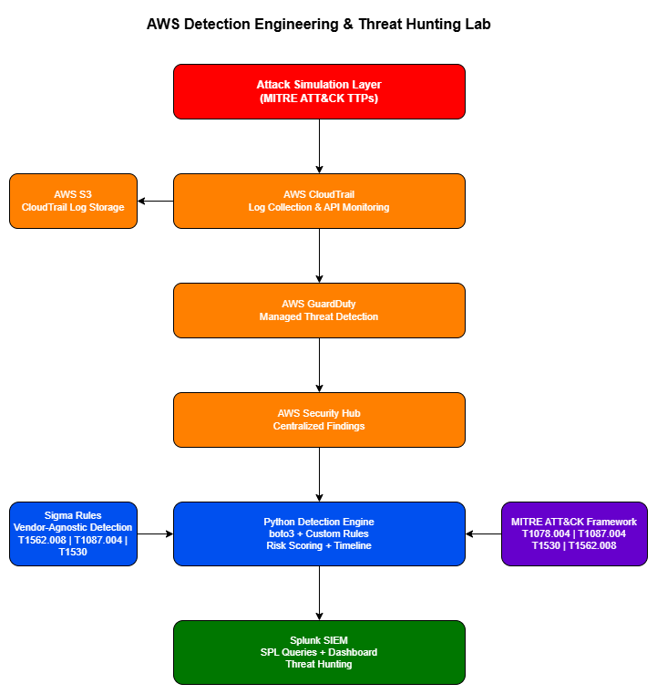

# AWS Detection Engineering & Threat Hunting Lab


> A hands-on AWS-native detection engineering lab simulating real-world
> cloud attack techniques, building automated detection logic, and
> demonstrating threat hunting across CloudTrail, GuardDuty, and Splunk.

---

## What This Project Demonstrates

- Building a detection pipeline from raw AWS logs to actionable findings
- Simulating real attacker TTPs in a controlled AWS environment
- Writing custom detection rules mapped to MITRE ATT&CK techniques
- Threat hunting using Python automation and Splunk SPL queries
- Centralizing security findings across AWS native services

---

## Architecture



The lab implements a complete detection pipeline:

**Attack Layer** — Simulates real MITRE ATT&CK techniques on owned infrastructure

**Collection Layer** — AWS CloudTrail captures all API activity, stored in S3

**Detection Layer** — GuardDuty managed detection + custom Python detection engine with risk scoring

**Analysis Layer** — Sigma rules converted to SPL, Splunk dashboard with live findings

**Framework** — All detections mapped to MITRE ATT&CK techniques
```

---

## MITRE ATT&CK Coverage

| Technique ID | Technique Name | Tactic | Detection Status |
|---|---|---|---|
| T1078.004 | Valid Accounts: Cloud Accounts | Initial Access | ✅ Detected + Splunk |
| T1087.004 | Account Discovery: Cloud Account | Discovery | ✅ Detected + Splunk |
| T1530 | Data from Cloud Storage | Collection | ✅ Detected + Splunk |
| T1562.008 | Impair Defenses: Disable Cloud Logs | Defense Evasion | ✅ Detected + Splunk |
| T1548 | Abuse Elevation Control | Privilege Escalation | ⏳ Phase 6 |

---

## Repository Structure

**src/detection_engine/** — Core detection logic (CloudTrail analyzer, rule engine, timeline builder)

**src/threat_hunting/** — Threat hunting scripts and notebooks

**rules/sigma/** — Sigma detection rules mapped to MITRE ATT&CK

**simulations/attack_scenarios/** — Documented attack simulations (IAM recon, S3 exfiltration, CloudTrail disable)

**findings/reports/** — Detection findings and JSON evidence files

**findings/screenshots/** — Evidence screenshots including Splunk dashboard

**diagrams/** — Architecture diagrams

**docs/** — Full documentation (setup guide, architecture decisions, attack scenarios, MITRE mapping)

**tests/** — Unit tests

**.env.example** — Environment variable template

**requirements.txt** — Python dependencies

**DISCLAIMER.md** — Legal disclaimer

---

## Tech Stack

| Category | Technology |
|---|---|
| Cloud Platform | AWS (CloudTrail, GuardDuty, Security Hub, S3, IAM) |
| Detection Engine | Python 3.14, boto3 |
| Detection Rules | Sigma Rules |
| SIEM | Splunk (Free Tier) |
| Infrastructure as Code | Terraform |
| Frameworks | MITRE ATT&CK |
| Version Control | Git, GitHub |

---

## Cross-Cloud Equivalents

| AWS Service | Azure Equivalent | GCP Equivalent |
|---|---|---|
| CloudTrail | Azure Monitor / Activity Logs | Cloud Audit Logs |
| GuardDuty | Microsoft Defender for Cloud | Security Command Center |
| Security Hub | Microsoft Sentinel | Chronicle SIEM |
| IAM | Azure AD / Entra ID | Cloud IAM |
| S3 | Azure Blob Storage | Cloud Storage |

---

## Setup

### Prerequisites
- AWS Account (Free Tier)
- Python 3.10+
- AWS CLI configured
- Docker (for local services)

### Installation

```bash
# Clone the repository
git clone https://github.com/Lalith012/aws-detection-lab.git
cd aws-detection-lab

# Create virtual environment
python -m venv venv
venv\Scripts\activate  # Windows
source venv/bin/activate  # Linux/Mac

# Install dependencies
pip install -r requirements.txt

# Configure environment
copy .env.example .env
# Edit .env with your AWS credentials
```

---

## Project Status

| Phase | Description | Status |
|---|---|---|
| Phase 1 | Repository setup and documentation | ✅ Complete |
| Phase 2 | CloudTrail, Security Hub, Detection Engine | ✅ Complete |
| Phase 3 | Attack simulation — IAM recon, S3 exfiltration, CloudTrail disable | ✅ Complete |
| Phase 4 | Advanced Python detection engine | ✅ Complete |
| Phase 5 | Sigma rules, Splunk integration, detection dashboard | ✅ Complete |
| Phase 6 | Full documentation, diagrams | ✅ Complete |

---

## Disclaimer

All techniques demonstrated in this repository were performed exclusively
on infrastructure owned by the author. See [DISCLAIMER.md](DISCLAIMER.md)
for full details.

---

## Author

**Lalith**
[GitHub](https://github.com/Lalith012)
